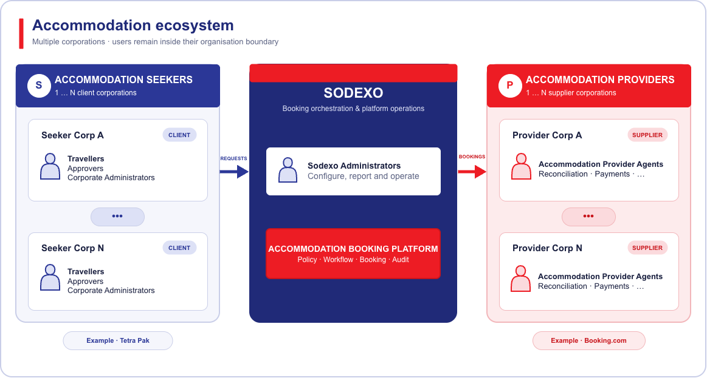

import ExpandableRoleCard from '@site/src/components/ExpandableRoleCard';
import JourneyScenario from '@site/src/components/JourneyScenario';
import RoleGroup from '@site/src/components/RoleGroup';

# Entities

The accommodation ecosystem supports multiple client corporations and multiple
provider corporations. Every corporation retains its own users and
organisational boundary, while Sodexo coordinates the booking interaction.



# Users

The accommodation ecosystem serves six roles across client corporations,
Sodexo operations, and accommodation provider corporations. Expand a role to
review its associated user journeys.

:::info Corporate policy context

A corporate is the client organisation rather than a user. It owns a travel
policy that defines role eligibility, permitted destinations, and price ranges
for its travellers, approvers, administrators, and booking operators.

:::

## User groups

<RoleGroup
  eyebrow="Client corporation"
  title="Accommodation seeker corporation users"
  description="Employees and administrators acting within a client corporation's tenant, policy, and organisational scope."
  tone="seeker"
>

<ExpandableRoleCard
  index="01"
  name="Traveller"
  description="A corporate employee who searches for accommodation, submits requests, and tracks their outcome."
>

1. Sign in through the existing Sodexo B2C application.
2. Select a permitted office destination, dates, and accommodation requirements.
3. Search, filter, and compare policy-evaluated Booking.com proposals.
4. Review the price, cancellation conditions, and policy explanation.
5. Select an option and submit an accommodation request.
6. Respond to clarification requests and track approval and booking statuses.
7. Receive the confirmed reservation or a clear rejection or failure outcome.

**Traveller journey 1 · Select accommodation**

```plantuml-image
./traveller-journey-1-select-accommodation.puml | Traveller journey — select accommodation
```

**Traveller journey 2 · Cancel a submitted request**

```plantuml-image
./traveller-journey-2-cancel-request.puml | Traveller journey — cancel a submitted request
```

**Traveller journey 3 · Edit a submitted request**

```plantuml-image
./traveller-journey-3-edit-request.puml | Traveller journey — edit a submitted request
```

**Traveller journey 4 · View requests**

```plantuml-image
./traveller-journey-4-view-requests.puml | Traveller journey — view requests
```

**Traveller journey 5 · Follow up on an unapproved request**

```plantuml-image
./traveller-journey-5-follow-up.puml | Traveller journey — follow up on an unapproved request
```

**Traveller journey 6 · Download or email the confirmation letter**

```plantuml-image
./traveller-journey-6-download-confirmation.puml | Traveller journey — download or email the confirmation letter
```

**Traveller journey 7 · View accommodation contact details**

```plantuml-image
./traveller-journey-7-view-contact-details.puml | Traveller journey — view accommodation contact details
```

**Traveller journey 8 · Raise a booking issue**

```plantuml-image
./traveller-journey-8-raise-issue.puml | Traveller journey — raise a booking issue
```

</ExpandableRoleCard>

<ExpandableRoleCard
  index="02"
  name="Approver"
  description="A traveller with additional authority to approve or reject requests from eligible subordinates."
>

<JourneyScenario
  title="View and manage the approval queue"
  description="Find requests raised by travellers within the approver's authorised organisational scope."
>

1. Open the list of requests awaiting a decision.
2. Filter by traveller, destination, travel date, policy status, or request age.
3. Prioritise urgent and soon-to-expire accommodation offers.
4. Open a request while preserving the queue position and current filters.

</JourneyScenario>

<JourneyScenario
  title="Review an accommodation request"
  description="Assess the request, selected offer, policy result, and supporting business context."
>

1. Review the traveller, destination, dates, guest count, and business purpose.
2. Inspect the selected accommodation, nightly rate, total price, and cancellation conditions.
3. Compare the request with the applicable role, destination, and price-range policy.
4. Review previous clarification messages, attachments, and exception evidence.
5. Confirm that the approver is authorised and is not approving their own request.

</JourneyScenario>

<JourneyScenario
  title="Approve a request"
  description="Authorise a compliant request to proceed to booking operations."
>

1. Confirm that the request is complete and within policy, or that an exception is justified.
2. Add an optional decision note.
3. Approve the request.
4. Notify the traveller and route the request to the booking-operator queue.
5. Retain the policy snapshot, decision, actor, and timestamp in the audit history.

</JourneyScenario>

<JourneyScenario
  title="Reject a request"
  description="Stop a request that is unsupported, incomplete, or outside acceptable policy."
>

1. Select a rejection category and provide a clear reason.
2. Reject the request and prevent downstream booking.
3. Notify the traveller with the decision and available next action.
4. Retain the rejected request and decision evidence for reporting and audit.

</JourneyScenario>

<JourneyScenario
  title="Seek clarification and resume the decision"
  description="Return an incomplete request to the traveller without losing its history."
>

1. Identify the missing business purpose, traveller detail, attachment, or exception evidence.
2. Send a clarification question and move the request to an awaiting-response state.
3. Notify the traveller and pause the approval service-level timer where applicable.
4. Review the traveller's response and any amended request details.
5. Approve, reject, or request further clarification with a complete conversation trail.

</JourneyScenario>

<JourneyScenario
  title="Reassess a materially changed offer"
  description="Make a fresh decision when price, availability, or booking conditions change before fulfilment."
>

1. Review the operator's explanation and the replacement offer.
2. Compare the changed price and conditions with the original approval and policy snapshot.
3. Approve the revised offer, reject it, or seek clarification.
4. Preserve both decisions and their related offer versions.

</JourneyScenario>

</ExpandableRoleCard>

<ExpandableRoleCard
  index="03"
  name="Corporate Administrator"
  description="A client-side administrator who maintains travel policies, destinations, role levels, and price ranges."
>

<JourneyScenario
  title="Manage travel policies"
  description="Create, review, publish, and retire versioned corporate travel rules."
>

1. Review the currently effective policy and its activation dates.
2. Create a draft policy version without changing historical requests.
3. Configure eligibility, advance-booking, stay-duration, exception, and approval rules.
4. Preview the impact on representative traveller and destination scenarios.
5. Publish the policy with an effective date and retain the previous version for audit.

</JourneyScenario>

<JourneyScenario
  title="Manage corporate roles and assignments"
  description="Define corporate role levels and control who may travel, approve, or administer."
>

1. Review the corporation's role catalogue and user assignments.
2. Create or update role levels such as General Employee, Director, and C-Level.
3. Assign travellers, approvers, and administrators within the authorised organisation hierarchy.
4. Configure approval relationships, delegation, and effective dates.
5. Remove or expire access without deleting historical actions.

</JourneyScenario>

<JourneyScenario
  title="Manage destinations and corporate sites"
  description="Control which office destinations and sites are available to the corporation."
>

1. Review countries, cities, offices, and permitted accommodation destinations.
2. Add a destination and associate it with one or more corporate sites.
3. Configure availability dates, booking guidance, and destination-specific restrictions.
4. Temporarily suspend or retire a destination.
5. Preview the destination list visible to eligible travellers.

</JourneyScenario>

<JourneyScenario
  title="Manage price ranges and exceptions"
  description="Set destination-specific nightly limits for each corporate role level."
>

1. Select a role level, destination, currency, and effective period.
2. Define the permitted nightly range and any tax or fee treatment.
3. Configure warning, hard-stop, and exception-approval behaviour.
4. Compare the new range with current market and booking data.
5. Publish the versioned price rule and retain its change history.

</JourneyScenario>

<JourneyScenario
  title="Validate accommodation bills"
  description="Check supplier or Sodexo billing against confirmed stays and agreed commercial terms."
>

1. Open bills awaiting corporate validation.
2. Match each charge to the booking reference, traveller, stay dates, and approved amount.
3. Review taxes, fees, cancellations, no-shows, credits, and price variances.
4. Accept valid lines and raise a dispute or clarification for mismatches.
5. Confirm the validated amount with evidence and an audit timestamp.

</JourneyScenario>

<JourneyScenario
  title="Approve and make payments"
  description="Authorise validated bills and track payment through the corporation's finance process."
>

1. Review the validated bill, cost allocation, payment terms, and outstanding disputes.
2. Approve the payable amount within the administrator's financial authority.
3. Submit or export the payment instruction to the authorised finance system.
4. Record the payment reference and expected settlement date.
5. Track paid, partially paid, failed, and reversed outcomes without duplicating payment.

</JourneyScenario>

<JourneyScenario
  title="Review spend, compliance, and audit reports"
  description="Monitor programme adoption, policy behaviour, billing, and privileged changes."
>

1. Select the reporting period, organisation scope, destination, or role level.
2. Review booking spend, policy exceptions, approval turnaround, and cancellation trends.
3. Monitor bill-validation and payment status.
4. Export authorised reports and drill into supporting records.
5. Review the configuration and access-change audit trail.

</JourneyScenario>

</ExpandableRoleCard>

</RoleGroup>

<RoleGroup
  eyebrow="Service operator"
  title="Sodexo users"
  description="Operational and platform roles that coordinate requests, bookings, configuration, reporting, and controlled support."
  tone="sodexo"
>

<ExpandableRoleCard
  index="04"
  name="Booking Operator"
  description="A service user who reviews approved requests and creates the real accommodation reservation."
>

<JourneyScenario
  title="Manage the booking work queue"
  description="Find approved requests assigned to the operator's client, destination, or service scope."
>

1. Open requests awaiting booking, clarification, or exception handling.
2. Filter and prioritise by travel date, approval age, client, or booking risk.
3. Claim or assign a request to prevent duplicate operator activity.
4. Open the complete request, approval, and communication history.

</JourneyScenario>

<JourneyScenario
  title="Validate and create a booking"
  description="Turn an approved request into a confirmed Booking.com reservation."
>

1. Validate the traveller details, approval evidence, policy result, and selected offer.
2. Recheck live price, availability, room conditions, taxes, and cancellation terms.
3. Preview the final order and verify that no material condition has changed.
4. Create the Booking.com order through the controlled server-side workflow.
5. Record the supplier reference and immutable booking response.
6. Confirm the reservation to the traveller and close the work item.

</JourneyScenario>

<JourneyScenario
  title="Handle a changed price or unavailable offer"
  description="Resolve material differences discovered between approval and booking."
>

1. Compare the live offer with the approved offer snapshot.
2. Search for an equivalent policy-compliant replacement where permitted.
3. Return the revised offer for renewed approval when price or conditions materially change.
4. Preserve the original offer, replacement offer, and reason for the change.
5. Resume booking only after the required traveller or approver decision.

</JourneyScenario>

<JourneyScenario
  title="Resolve a failed or uncertain booking"
  description="Investigate supplier errors without creating duplicate reservations."
>

1. Record the request identifier, idempotency key, supplier response, and failure stage.
2. Query the supplier order status before attempting any retry.
3. Confirm success when a reservation exists despite a timeout.
4. Retry only when the previous outcome is conclusively absent or safely idempotent.
5. Escalate unresolved outcomes and keep the traveller informed.

</JourneyScenario>

<JourneyScenario
  title="Amend or cancel a reservation"
  description="Process supported post-booking changes with clear commercial impact."
>

1. Review the traveller's request and the supplier's amendment or cancellation rules.
2. Preview fees, refunds, availability, and approval implications.
3. Obtain any required traveller or approver confirmation.
4. Submit the supported change through the supplier workflow.
5. Update the booking record and notify all affected parties.

</JourneyScenario>

<JourneyScenario
  title="Create a request on behalf of a traveller"
  description="Support an authorised traveller while preserving delegated-action evidence."
>

1. Select the traveller within the operator's authorised corporate scope.
2. Capture the trip need, destination, dates, and accommodation requirements.
3. Search and select an offer under the traveller's effective policy.
4. Submit the request through the normal approval path.
5. Record both the operator actor and the represented traveller in the audit history.

</JourneyScenario>

<JourneyScenario
  title="Investigate a booking issue"
  description="Coordinate resolution of traveller, supplier, payment, or reservation-reference problems."
>

1. Locate the booking and review its complete status and communication history.
2. Classify the issue and collect the relevant evidence.
3. Contact the provider channel or internal support team through the approved process.
4. Record updates, agreed actions, and resolution deadlines.
5. Notify the traveller and close the issue only after the outcome is confirmed.

</JourneyScenario>

</ExpandableRoleCard>

<ExpandableRoleCard
  index="05"
  name="Sodexo Administrator"
  description="A platform administrator who manages corporates, users, system configuration, and operational reporting."
>

<JourneyScenario
  title="Onboard and maintain a corporate tenant"
  description="Create the client boundary and connect its core identity and operational configuration."
>

1. Create the corporate tenant and record its legal, regional, and support details.
2. Configure identity mapping, organisation identifiers, currencies, and localisation.
3. Assign the initial corporate administrators and operator scope.
4. Validate the setup in a controlled environment.
5. Activate the tenant and retain an auditable onboarding record.

</JourneyScenario>

<JourneyScenario
  title="Manage platform roles and access"
  description="Control privileged access across corporate, operator, and Sodexo responsibilities."
>

1. Review users, service accounts, role assignments, and effective scopes.
2. Grant, modify, expire, or revoke access under least-privilege rules.
3. Enforce segregation of duties for approval, booking, billing, and administration.
4. Review dormant and high-risk access periodically.
5. Preserve every privileged access change for audit.

</JourneyScenario>

<JourneyScenario
  title="Configure supplier integrations"
  description="Maintain Booking.com endpoints and operational settings without exposing secrets."
>

1. Select the environment and integration profile.
2. Configure endpoints, feature flags, timeouts, retry limits, and callback settings.
3. Reference credentials through the approved secret-management mechanism.
4. Test connectivity and supported API capabilities.
5. Promote a validated configuration with rollback information and change evidence.

</JourneyScenario>

<JourneyScenario
  title="Monitor booking and approval operations"
  description="Detect unhealthy queues, failed integrations, and delayed business workflows."
>

1. Review platform health, queue depth, latency, error rate, and supplier availability.
2. Drill into failed approval, booking, notification, or callback workflows.
3. Correlate events using the request, booking, and supplier identifiers.
4. Trigger an approved retry, escalation, or incident process.
5. Track recovery and record the operational outcome.

</JourneyScenario>

<JourneyScenario
  title="Resolve reconciliation exceptions"
  description="Investigate differences between platform bookings, supplier records, invoices, and payments."
>

1. Open unmatched, duplicated, or value-mismatched reconciliation items.
2. Compare internal events with supplier references and financial records.
3. Classify timing differences, data defects, booking failures, or financial disputes.
4. Correct authorised reference data or route the exception to the responsible team.
5. Close the exception with evidence and without rewriting immutable booking history.

</JourneyScenario>

<JourneyScenario
  title="Generate operational and audit reports"
  description="Provide authorised insight into adoption, service performance, compliance, and privileged activity."
>

1. Select the reporting period, corporate scope, region, and data classification.
2. Generate adoption, approval, booking, failure, reconciliation, and audit reports.
3. Apply masking and access controls to personal and commercially sensitive data.
4. Export or schedule the report for authorised recipients.
5. Record report generation and distribution where required.

</JourneyScenario>

<JourneyScenario
  title="Support a controlled investigation"
  description="Help diagnose user or booking problems without silently impersonating another person."
>

1. Confirm the support request, authorisation, and affected corporate scope.
2. Review logs, events, configuration, and masked business records.
3. Use controlled support tooling rather than changing user-owned data directly.
4. Apply an approved correction or coordinate remediation with the owning team.
5. Record the investigator, evidence accessed, actions taken, and outcome.

</JourneyScenario>

</ExpandableRoleCard>

</RoleGroup>

<RoleGroup
  eyebrow="Supplier corporation"
  title="Accommodation provider corporation users"
  description="Supplier-side users who fulfil reservations and support the commercial and operational lifecycle in provider systems."
  tone="provider"
>

<ExpandableRoleCard
  index="06"
  name="Accommodation Provider Agent"
  description="A supplier-side user who manages accommodation inventory, reservations, and financial follow-up in the provider's own systems."
>

<JourneyScenario
  title="Manage accommodation configuration"
  description="Maintain the property content and booking conditions exposed through the provider channel."
>

1. Maintain property identity, address, facilities, room types, and guest policies.
2. Configure rates, taxes, fees, cancellation terms, and payment conditions.
3. Update availability and temporary sales restrictions.
4. Validate how the accommodation appears through the distribution channel.
5. Publish the configuration with its effective timing and change history.

</JourneyScenario>

<JourneyScenario
  title="Receive and fulfil a reservation"
  description="Confirm that a supplier-side booking is valid and operationally ready for the guest."
>

1. Receive the reservation through the Booking.com distribution channel.
2. Validate the stay, guest, room, commercial, and payment details.
3. Retain the provider and distribution-channel references.
4. Confirm fulfilment or raise an exception when the reservation cannot be honoured.
5. Make the confirmed status available to the connected booking workflow.

</JourneyScenario>

<JourneyScenario
  title="Process an amendment or cancellation"
  description="Apply supported booking changes and communicate their financial impact."
>

1. Locate the reservation using the supplier or channel reference.
2. Review the requested change against availability and booking conditions.
3. Calculate any price difference, fee, refund, or restriction.
4. Confirm or reject the change through the provider channel.
5. Retain the revised reservation state and commercial evidence.

</JourneyScenario>

<JourneyScenario
  title="Provide booking support"
  description="Investigate reservation, property, or guest-service issues raised through the support channel."
>

1. Review the booking reference, issue category, and supporting evidence.
2. Validate the reservation state in the provider's system.
3. Coordinate with the property or distribution-channel support team.
4. Provide a resolution, workaround, or escalation with an expected timeline.
5. Record the final outcome and communicate it through the connected support process.

</JourneyScenario>

<JourneyScenario
  title="Provide invoices and settlement information"
  description="Supply the commercial records needed to validate charges and settle completed stays."
>

1. Generate or retrieve the invoice for the completed, cancelled, or no-show stay.
2. Include booking references, taxes, fees, credits, and payment terms.
3. Submit the invoice through the agreed commercial channel.
4. Respond to bill-validation questions or issue a correction or credit note.
5. Track the invoice through accepted, disputed, and settled states.

</JourneyScenario>

<JourneyScenario
  title="Resolve a reconciliation discrepancy"
  description="Investigate mismatches between the provider reservation, invoice, settlement, and platform records."
>

1. Review the disputed reference, amount, currency, dates, and reservation state.
2. Compare provider records with distribution-channel and payment evidence.
3. Identify timing differences, duplicate charges, missing credits, or reference errors.
4. Correct authorised provider data or supply evidence to the responsible reconciliation team.
5. Confirm closure and retain the resolution history.

</JourneyScenario>

This is an ecosystem role rather than a direct user of the Sodexo B2C
application. The journeys occur primarily in provider systems, while
integrations exchange reservation status, references, and commercial outcomes.

</ExpandableRoleCard>

</RoleGroup>

## Cross-role controls

- Corporate and assignment scope must come from trusted server-side identity
  context, not editable browser fields.
- Approvers cannot approve their own requests.
- Policy and approval decisions must be preserved as immutable snapshots.
- On-behalf-of actions must identify both the actor and the traveller.
- Privileged configuration, decisions, and booking actions require audit
  evidence.
